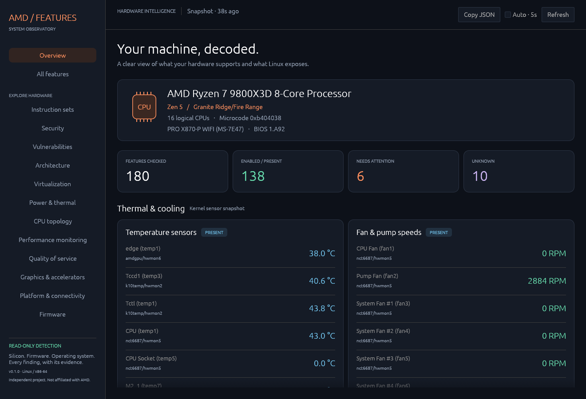
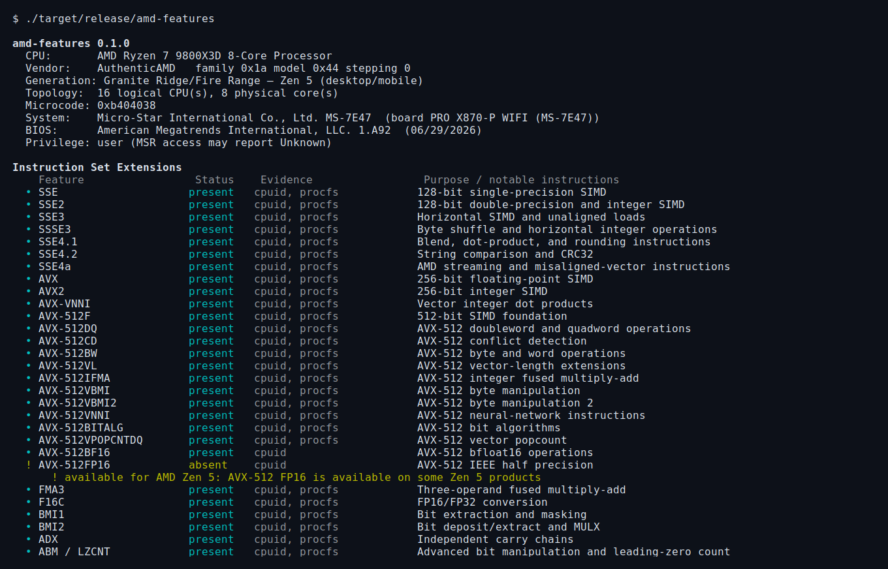

# amd-features

`amd-features` is a modular, read-only detector for AMD processors and platforms on
Linux/x86-64. It reports silicon support, firmware enablement, and operating-system
state separately instead of collapsing them into one ambiguous yes/no answer.

## Screenshots

Captured on an AMD Ryzen 7 9800X3D system running Linux, using the default
unprivileged probes. Results vary with hardware, firmware, kernel, and permissions.

### GUI overview

The native System Observatory shows hardware identity, feature counts, and live
sensor snapshots. Launch it with `./target/release/amd-features --gui`.



### CLI report

The terminal report shows feature status, evidence sources, and hardware-class
attention markers. This screenshot shows the beginning of the report from
`./target/release/amd-features`.



## What it detects

The catalog covers AMD and common x86 features across instruction sets, speculation
controls, Secure Memory Encryption (SME), Secure Encrypted Virtualization
(SEV/SEV-ES/SEV-SNP), AMD-V/SVM and nested paging, CPPC/Core Performance Boost,
topology, memory-channel capability, Instruction-Based Sampling, Platform QoS, AMD
PCI devices and motherboard chipsets, ACPI, UEFI, SMBIOS memory, and kernel
vulnerability mitigations.

Eleven independent probes provide traceable evidence:

- **cpuid** reads standard and AMD extended leaves on every eligible logical CPU,
  pinned one CPU at a time. It reports asymmetric feature exposure, the processor
  signature and brand, microcode revision, and a family/model lookup. Shared
  model ranges (for example Genoa vs Storm Peak) are disambiguated from the
  processor brand string; otherwise the report keeps a slash-separated name.
- **procfs** cross-checks CPUID against every matching `/proc/cpuinfo` flag.
- **linux-sysfs** reports SMT and KVM state, `amd_pstate`, boost clocks, PPT/TDP,
  3D V-Cache, Infinity Fabric/memory data rate, XMP/EXPO profiles from SPD EEPROM,
  CPU idle, AMD energy/hwmon drivers, TPM, resctrl/PQoS, Bluetooth, and IPMI.
  It also reports CPU power policies, hwmon temperature/fan readings, and USB4
  routers through the runtime interfaces described below.
- **linux-vuln** preserves the kernel's mitigation text from
  `/sys/devices/system/cpu/vulnerabilities`.
- **msr** performs read-only AMD MSR queries for VM_CR, SYSCFG, SEV status, HWCR,
  and current hardware P-state. It never writes a register.
- **pci** inventories AMD/ATI PCI functions including integrated vs discrete Radeon
  GPUs (VRAM, GTT/UMA, ReBAR/SAM, VCN/UVD, ROCm/KFD), Ryzen AI/XDNA, PSP/CCP,
  chipset bridges, audio, SMBus, USB, SATA, NVMe, and networking.
- **sdci** inspects PCIe root-port TPH completers and all-vendor TPH requesters,
  plus running-kernel TPH configuration, for the dedicated SDCI report.
- **acpi** detects AMD-Vi through IVRS/IOMMU state plus LPIT, NFIT, CEDT, HMAT,
  HPET, SRAT, WSMT, and TPM2.
- **efi** reports UEFI boot, Secure Boot, Setup Mode, and ESRT.
- **dmi** reports board/BIOS identity, memory ECC capability, and populated DIMMs
  with rated vs firmware-configured operating speed.
- **memory-topology** infers the maximum channels per CPU socket from the AMD product
  and board class, and separately reports EDAC controller visibility. It does not claim
  that the maximum channel count is populated or active when Linux exposes no telemetry.

Chipset reporting prefers an exact chipset token from the DMI board name and corroborates
it with AMD Promontory PCI functions. When only shared PCI IDs are available, it reports
the chipset family and explicitly leaves the retail SKU unknown.

Missing, inaccessible, malformed, or partially enumerated authoritative interfaces are
reported as `unknown`. `absent` is only used when the relevant parent interface was
successfully inspected. On a non-AMD CPU, vendor-specific CPUID and MSR findings are
reported as unknown rather than mis-decoded.

### SDCI report

The CLI, JSON (`categories[].category = "sdci"`), and GUI include a dedicated
**SDCI — Smart Data Cache Injection** section. The GUI also shows it on the overview.
It separates:

- **CPU SDCIAE**: CPUID `80000020H`, subleaf 0, EBX bit 6, sampled by the existing
  per-CPU probe. This is allocation-enforcement support, not an SDCI enable bit.
- **Root-port TPH**: each PCIe root port's TPH and extended-TPH completer support.
- **Device TPH**: requester modes, current requester enablement, raw capability and
  control registers, and bound driver for devices from every vendor. A supported
  No-ST mode remains valid without a steering table. Enabled means the requester
  control permits TPH traffic; it does not establish actual cache injection.
- **Kernel TPH**: `CONFIG_PCIE_TPH` from the running kernel's `/boot/config-*` and
  the `notph` boot option. Kernel version alone is insufficient.
- **Firmware / chipset** and **Active SDCI**: explicitly unknown, because the tool
  does not evaluate firmware cache-locality methods, read a BIOS SDCI setting, or
  measure cache injection. A chipset name or PCIe switch does not prove support.

PCI configuration access often requires root. Short reads, inaccessible devices,
malformed capability chains, and incomplete enumeration produce unknown results,
while retaining readable evidence. Mixed per-device states are also unknown at the
section-row level; each device's state remains visible. Absent SDCI prerequisites
remain visible even without `--all`. No configuration registers are written and no
privilege escalation is performed by the tool.

References: [Linux TPH documentation](https://docs.kernel.org/PCI/tph.html),
[Linux PCI register definitions](https://github.com/torvalds/linux/blob/master/include/uapi/linux/pci_regs.h),
and [AMD64 System Programming manual](https://docs.amd.com/api/khub/documents/sD1_QL~h4Afq2_tvzxqqSQ/content).

### Runtime snapshots

The following read-only snapshots appear in both the normal text report and JSON:

- **CPU Power Policy** (`power_policy`): global AMD P-State mode and preferred-core
  setting, plus each cpufreq policy's driver, governor, energy-performance preference
  (EPP), available preferences/governors, configured minimum/maximum frequency, and
  per-policy boost state when exposed. Policies with identical reported settings are
  grouped; different policies remain separate. These are configured limits, not
  measured clocks. Missing optional EPP support is explicitly marked as not exposed.
- **Temperatures** (`temperatures`) and **Fan Speeds** (`fan_speeds`): all enumerated
  hwmon temperature and fan input channels, including CPU, GPU, DIMM, motherboard,
  storage, and network-device sensors. Driver name, hwmon device, channel ID, and
  kernel-provided label identify each reading. Temperatures are shown in degrees
  Celsius and fan speeds in RPM. Disabled and faulty channels are identified; valid
  readings survive partial failures, with the overall snapshot marked unknown.
  Values and labels come directly from the kernel, without applying `sensors.conf`
  overrides or legacy voltage-to-temperature conversions. Zero readings are preserved: zero RPM alone does not prove a fan fault,
  and unused motherboard channels may report zero temperature.
- **USB4** (`usb4`): routers reporting `generation=4` on the Linux Thunderbolt bus,
  regardless of vendor, including ASMedia controllers. Reports host/device identity,
  authorization, domain security and IOMMU DMA-protection state, and RX/TX speed per
  lane and lane counts when exposed. An enabled result means a USB4 router is
  enumerated; it does not imply a connected peripheral or an authorized PCIe tunnel.
  Thunderbolt generations 1–3 are not classified as USB4. A missing bus interface is
  unknown; an inspected bus with no USB4 routers is reported as absent from that bus.

These are sequential snapshots, not continuous monitoring or atomic samples. No
power policy, fan control, device authorization, or firmware setting is changed.
The interfaces follow the Linux kernel documentation for
[AMD P-State](https://docs.kernel.org/admin-guide/pm/amd-pstate.html),
[hwmon](https://docs.kernel.org/hwmon/sysfs-interface.html), and
[Thunderbolt/USB4 sysfs](https://github.com/torvalds/linux/blob/master/Documentation/ABI/testing/sysfs-bus-thunderbolt).

## Class-aware attention

For recognized Zen-family processors, the report compares detections with a conservative
generation profile without changing the underlying detection status:

- **Red `!`** means a baseline capability expected for that hardware class is reported
  absent or disabled. For example, AVX-512 foundation support missing on Zen 4/5 is
  highlighted even when `--all` was not requested.
- **Yellow `!`** means the class can provide the capability, but availability depends on
  the product, firmware settings, kernel support, or runtime configuration.

Unknown results are not treated as missing. The JSON report exposes separate
`expectation` and `attention` fields so automation can distinguish measured state from
the class-based assessment.

## Suggested fixes

When a probe can tell *why* a feature is not usable and the cause is fixable locally,
for example resctrl not mounted, the `msr` driver not loaded, CPU boost or SMT turned
off, or missing group membership for `/dev/kvm` or `/dev/kfd`, it attaches a hint. The text
report lists each distinct hint once under **Suggested fixes**, together with the
features it affects. `--verbose` also shows each hint under the probe that produced it.
The GUI shows hints on the feature card, and JSON exposes them as `hint` on each
detection and `hints` on each feature. Hints are dropped once a feature is enabled. The
tool only suggests commands; it never runs them.

## Install

[Releases](https://github.com/nuclearcat/amd-features/releases) provide x86_64 builds:

- `amd-features_<version>-1_amd64.deb` for Debian 12+ and Ubuntu 22.04+
  (`sudo apt install ./amd-features_*.deb`)
- `amd-features-<version>-1.x86_64.rpm` for Fedora, openSUSE and other RPM distributions
- `amd-features-<version>-x86_64-linux-gnu.tar.gz` for the CLI and GUI on any distribution with glibc 2.35+
- `amd-features-<version>-x86_64-linux-musl-cli.tar.gz`, a fully static CLI without the GUI

Maintainers build these with `scripts/release.sh` (needs Docker, `cargo-deb`,
`cargo-generate-rpm` and the `x86_64-unknown-linux-musl` target).

## Build and run

```sh
cargo build --release
./target/release/amd-features
./target/release/amd-features --json
./target/release/amd-features --all --verbose
./target/release/amd-features --gui
sudo ./target/release/amd-features --load-msr-module
```

Options: `--gui`, `--json/-j`, `--verbose/-v`, `--all/-a`, `--no-color`,
`--load-msr-module`, `--help/-h`, and `--version/-V`.

The program is non-mutating by default. `--load-msr-module` permits one `modprobe msr`
attempt only when the effective UID is root and `/dev/cpu/0/msr` is missing. Root does
not guarantee access in containers, under kernel lockdown, or with restrictive device
cgroups.

### Native desktop GUI

`--gui` opens the System Observatory, a native egui desktop window. The overview
shows CPU/board identity, feature counts, temperatures, fan and pump speeds, power
policy, USB4, and report notes. The feature browser includes every catalog entry,
including absent and unknown results. Browse by category or search names, IDs,
descriptions, and probe evidence; filter by status or class-based attention. Expand
a feature to inspect all contributing probes and its hardware-class assessment.

Use **Refresh** for a new snapshot, or enable **Auto · 5s** for periodic collection.
Scanning runs on one background worker at a time; the previous report remains visible
while a refresh is running, and failed refreshes are reported explicitly. **Copy
JSON** copies the complete current report, regardless of the active filters.
The GUI performs the same read-only probes as the CLI and needs an X11 or Wayland
desktop with OpenGL support. It does not require a browser or a local web server.
`--gui` and `--json` are mutually exclusive. Text-format flags (`--all`, `--verbose`,
and color flags) do not change the GUI, which always offers the full catalog and
expandable evidence.

GUI support is included in the default build. For a smaller CLI-only build without
desktop dependencies, use `cargo build --release --no-default-features`. The GUI can
be restored with `--features gui`. A CLI-only binary explains the missing build
feature if invoked with `--gui`.

## Architecture

```text
model      shared statuses, detections, categories, and feature metadata
catalog    static registry of AMD and common x86 features
cpu_db     AMD family/model classification, with brand disambiguation for shared ranges
probes/    one read-only module per detection mechanism
report     aggregation plus text and JSON rendering
```

Each detection includes a status, source, and evidence detail such as
`CPUID.8000000AH:EDX[0]`. Conflicting enabled and disabled findings produce an
`unknown` headline while retaining both findings for diagnosis.

## License and trademarks

Licensed under MIT OR Apache-2.0.

This independent project is not affiliated with or endorsed by Advanced Micro Devices,
Inc. AMD names are used only to identify compatible processors and technologies. See
[`TRADEMARKS.md`](TRADEMARKS.md).
